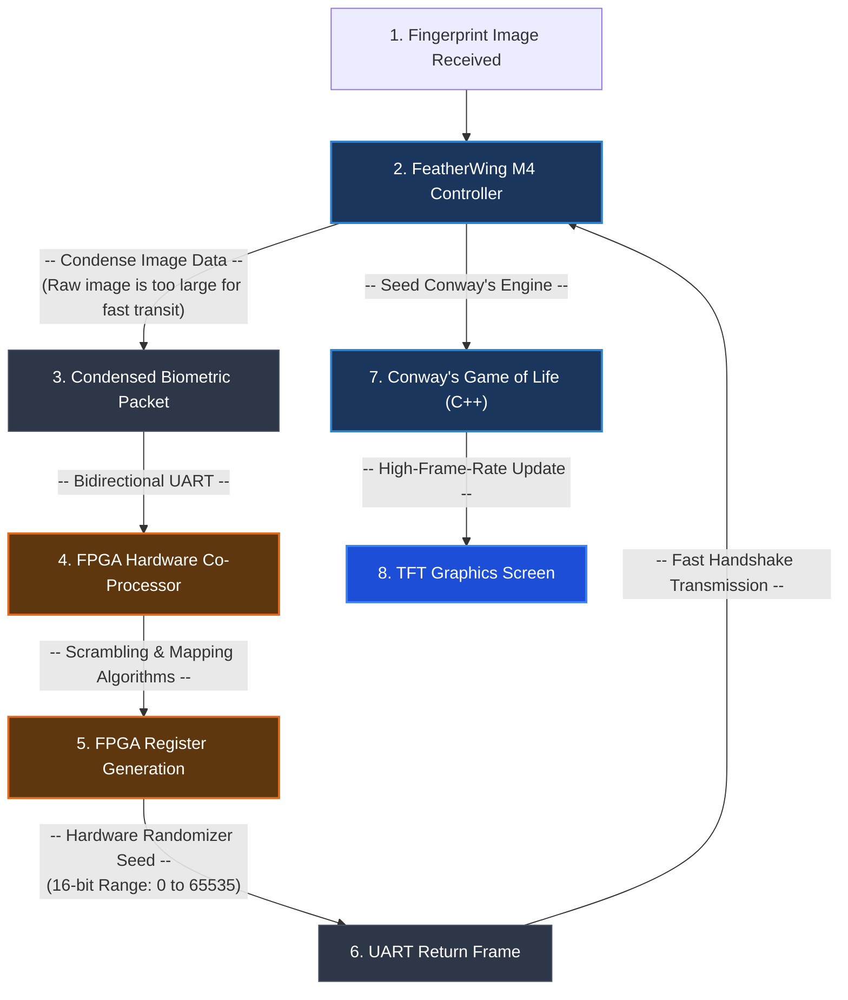

## Project Overview

This project showcases the design and implementation of an end-to-end hardware system: a biometric-seeded cellular automata generator. The system integrates an **Adafruit FeatherWing M4** controller and an **FPGA-based Hardware Randomizer**. 

When a fingerprint image is captured, the FeatherWing M4 processes it into a condensed, concise format (since raw fingerprint images are too large for direct transit) and transmits it to the FPGA. The FPGA runs custom randomization algorithms to generate a high-entropy 16-bit random seed (0 to 65535) and returns it over a custom **UART serial protocol**. The FeatherWing M4 then receives this hardware-generated seed to initialize a high-performance **Conway's Game of Life** simulation, rendering the evolving cellular patterns in real-time onto an attached TFT graphics screen.

The project seamlessly integrates hardware description languages (Verilog RTL), custom microcontroller firmware (C++), statistical validation, serial communication, and 3D CADD enclosure prototyping.

---

## Conway's Game of Life & FPGA Seed Demo

The video below demonstrates the fully integrated system in action. When a fingerprint is captured, the data is condensed and transmitted to the FPGA. The FPGA processes and randomizes the input, generating a high-entropy 16-bit seed that is instantly sent back over UART to the FeatherWing M4. The FeatherWing M4 runs the cellular automata engine in C++, rendering the cell generations dynamically onto the display screen based on this biometric seed.

<video width="100%" controls preload="metadata" poster="resources/Pictures/fpga-signal-processor/cadd_design_of_prototype.jpg" style="border-radius: 8px; margin: 1.5rem 0; box-shadow: 0 4px 20px rgba(0,0,0,0.3);">
  <source src="resources/Videos/fpga-signal-processor/demo.mp4" type="video/mp4">
  Your browser does not support the video tag.
</video>

---

## Biometric Seed-Generation & Hardware Loop

To achieve truly organic and unique seed initialization for Conway's Game of Life, the system utilizes a **closed-loop biometric hardware pipeline** between the Adafruit FeatherWing M4 and the FPGA. The entire data flow operates in a highly optimized sequence:

### Detailed Execution Flow
1. **Biometric Capture & Image Compression:** The system receives the fingerprint image. Because a raw fingerprint image file size is too massive to transmit efficiently within microsecond constraints, the FeatherWing M4 runs a preprocessing algorithm to compress and pack the key structural properties into a condensed, highly concise format.
2. **UART Transmission to FPGA:** The FeatherWing M4 transmits this concise biometric representation over the custom UART serial bridge to the FPGA registers.
3. **Hardware Randomization:** The FPGA serves as a dedicated hardware co-processor. It passes the incoming fingerprint signature through high-performance Verilog-implemented scrambling algorithms, mixing it with high-frequency hardware clock sampling to produce an incredibly chaotic state.
4. **Seed Extraction:** This scrambled state is mapped to a secure 16-bit address register, yielding an integer seed ranging from **0 to 65535**.
5. **UART Seed Return:** The FPGA returns this 16-bit seed value back to the FeatherWing M4 via the serial handshake channel.
6. **Game of Life Rendering:** The FeatherWing M4 receives the seed, instantly initializes the cellular automata grid using the unique biometric seed value, and begins rendering the evolving cell generations dynamically onto the TFT screen.

---

## Role & Core Contributions

As the lead electronics and systems integration developer on this project, my core contributions covered the electronics assembly, micro-controller programming, communications design, and enclosure modeling:

- **FeatherWing M4 Firmware & C++ Graphics:** Developed the complete C++ firmware including fingerprint image preprocessing (compressing the raw image data to a concise format for transmission), cellular automata engine logic, and the TFT display loop. **Generative AI was utilized to optimize rendering routines** for smooth, flicker-free graphics.
- **UART Communication Bridge:** Co-authored and adapted the bidirectional serial UART communication protocol. This protocol allows the FeatherWing M4 to transmit the condensed fingerprint data to the FPGA, and retrieves the randomized 16-bit seeds (0 to 65535) from the FPGA registers, building upon robust coursework reference protocols.
- **Electronics & System Integration:** Wired the dual-controller setup, managed signal grounding, handled serial line isolation, and distributed stable power to both the FPGA and the FeatherWing M4.
- **Physical Enclosure Modeling (CADD):** Designed a custom enclosure in Fusion 360 (Cadink) focused on aesthetic and ergonomic styling. The design features smooth, rounded corners to eliminate sharp edges that could irritate the user experience, ensuring any user can interact with and operate the device effectively and efficiently.

---

## Physical Enclosure & CAD Prototyping

To house the FPGA development board, FeatherWing M4 controller, and display module, I designed a multi-layer enclosure in **Fusion 360/CADD (Cadink)**. The core focus of the CAD work was on **aesthetic and ergonomic design**, ensuring that any user can interact with the physical device effectively and efficiently. By completely rounding the outer contours and removing sharp edges that could irritate the user experience, the enclosure provides a premium, smooth tactile feel. The models also feature exact alignments for board mounts, ports, and passive ventilation to prevent thermal build-up.

  

    
    
<small>Internal mounting bracket alignment and spacing layout</small>

  

  

    
    
<small>Isometric CAD view of the physical prototype enclosure</small>

  

  

    
    
<small>Ergonomic casing design with rounded, irritation-free edges</small>

  

---

## RTL Random Number Generation & Statistical Verification

The hardware-based random numbers are generated on the FPGA using a **Linear Feedback Shift Register (LFSR)** combined with high-frequency clock sampling. I constructed an automated HDL simulation testbench to inspect waveforms and log state transitions to verify logic behavior before flashing the FPGA.

### Statistical Test Results

To analyze the performance of the generated random numbers, I ran statistical tests on large sample outputs and plotted a frequency distribution histogram. While the distribution is not perfectly uniform, it provides a highly functional, chaotic seed source that effectively drives the Game of Life simulation.

  

    
    
<small>Verilog RTL simulation waveforms verifying state transitions and test case success</small>

  

  

    
    
<small>Statistical distribution histogram showing generated random seed spreads</small>

  

> 📊 **Note on Randomness Quality:** The initial sample tests revealed minor statistical spikes (not perfect uniformity), which serves as an excellent starting baseline for our hardware seeding. In future iterations, we can integrate a **von Neumann Corrector** to flat-line the entropy distribution.

---

## Technical Specifications & Engineering Challenges

### **System Architecture**
- **Hardware Stack:** Biometric Capture → FeatherWing M4 (SAMD51) → Bidirectional UART Protocol → FPGA Co-Processor → 16-bit Seed (0 to 65535) → FeatherWing M4 → TFT Display Screen
- **RTL Language:** Verilog (FPGA hardware)
- **Firmware Language:** C++ (Microcontroller graphics & data preprocessing)
- **Development Toolchain:** Xilinx Vivado (FPGA Synthesis), Arduino IDE (FeatherWing Firmware), Autodesk Fusion 360 (CAD Modeling)

### **Key Challenges & Solutions**

> **Challenge 1: High-Volume Biometric Transfer Over UART**
> - The raw fingerprint image was too large to transmit from the FeatherWing to the FPGA inside acceptable microsecond-level clock constraints.
> - **Solution**: Developed a preprocessing data-compression routine in the FeatherWing M4 firmware to condense the image. This concise packet was transmitted over a bidirectional, handshake-acknowledged UART serial protocol. The handshake splits outgoing/incoming frames securely, ensuring that zero data-bytes are lost and the returned 16-bit seed remains perfectly aligned.

> **Challenge 2: Microcontroller Graphics Optimization**
> - Rendering Conway's Game of Life cell grids pixel-by-pixel in C++ on a microcontroller display can cause visible flickering and slow frame rates.
> - **Solution**: Utilized **Generative AI to generate and optimize the C++ rendering and double-buffering routines**, resulting in highly efficient grid updates and smooth, lag-free cellular evolution.

> **Challenge 3: Multi-board Component Alignment**
> - Modeling a single physical enclosure to mount two distinct board forms (FPGA and FeatherWing) with precise cable pass-throughs is difficult without high-fidelity models.
> - **Solution**: Utilized high-precision caliper measurements to build exact digital twins of both boards in Fusion 360 first, leaving a safe 0.5 mm tolerance around port open spaces to ensure a snug, hassle-free mechanical fit.

---

## Deliverables & Key Competencies

- **C++ Microcontroller Development:** Full C++ firmware for the FeatherWing M4 incorporating fingerprint image condensation, custom simulation logic, and double-buffered graphics rendering.
- **RTL Verilog Hardware Design:** Complete Verilog code for the FPGA-based randomization co-processor and seed generator blocks.
- **UART Communication Layer:** Bidirectional UART transmission interface with resilient packet-handshake logic.
- **3D CADD Enclosure Prototyping:** Validated, exportable Fusion 360 models of the product housing shell.
- **AI-Assisted Engineering:** Proven capability to direct, audit, and integrate AI-generated code snippets in professional C++ firmware pipelines.

✅ Fully functional closed-loop biometric-to-seed hardware integration  
✅ Conway's Game of Life simulation seeded dynamically by fingerprint-derived FPGA random values  
✅ High-performance C++ rendering engine running on Adafruit FeatherWing M4  
✅ 3D CADD enclosure modeled and validated for electronics packaging  
✅ Statistical test logs & distribution histograms verifying performance  
